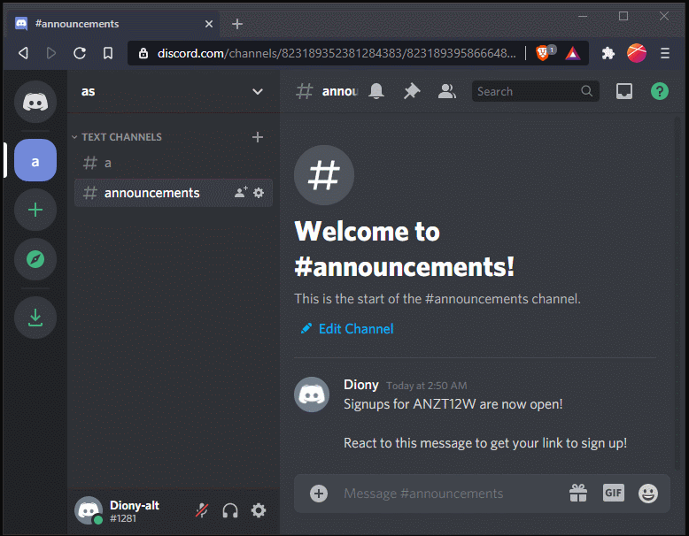
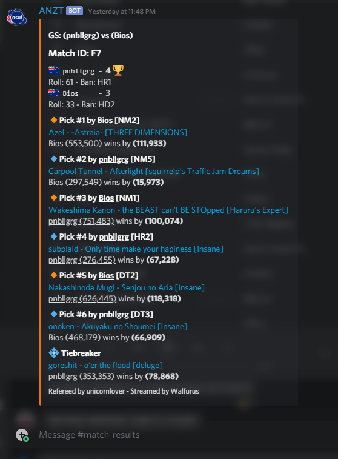
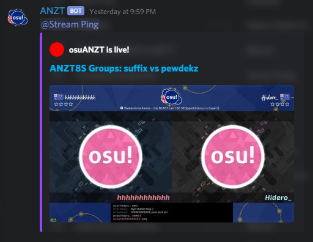
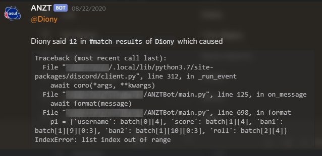

<h2 align=center>
ANZTBot</h2>

<i>A Discord bot made for the ANZT Discord server to assist with the running of <a href="https://osu.ppy.sh/home">osu!</a> tournaments.</i>

## Features:
### Tournament Registration System

See [server/README.md](server/) for details about the web server and [`tourney-signup.py`](cogs/tourney-signup.py) for the cog that it communicates with.

Allows users to sign up for tournaments by interacting with the bot.

This uses osu!'s OAuth2 service and is used to link each user's osu! and discord accounts. 
Previously we used Google Forms but this allowed people to sign up on behalf of others, regardless of their intention to play or not. In addition, form responses often contained human error.

### Match result reporting
See [`match-result-posting.py`](cogs/match-result-posting.py) for implementation.

The feature is triggered by the match ID being posted in our referee's channel. It fetches data from Google Sheets and the osu! API.

### Twitch channel ping
See [`twitch-pickem.py`](cogs/twitch-pickem.py) for implementation.

Includes a command to opt-in or out of receiving these pings by giving or removing the relevant discord role.

### Discord Error reporting
See [`error-reporting.py`](cogs/error-reporting.py) for implementation.

Pings a set user in a set channel for uncaught errors providing a full traceback and context.

## Requirements
See [`requirements.txt`](requirements.txt) for specific packages.

The following can be set in the `settings.py` file (refer [`settings_template.json`](settings_template.json)).
- A Discord bot's token. See [`discord.py`'s documentation](https://discordpy.readthedocs.io/en/latest/discord.html)
- A Google service account's credentials to read spreadsheets. See [`gpsread`'s documentation](https://gspread.readthedocs.io/en/latest/oauth2.html) which also applies to `gspread_asyncio`
- A Twitch Application's ID and secret. See [`python-twitch-client`'s documentation](https://python-twitch-client.readthedocs.io/en/latest/#authentication).
- ~PostgreSQL database credentials for the qualifier lobbies feature~

## Important
If you want to use this bot, you'll have to host it yourself and adapt the code to your use-case. Some coding knowledge will be required.
